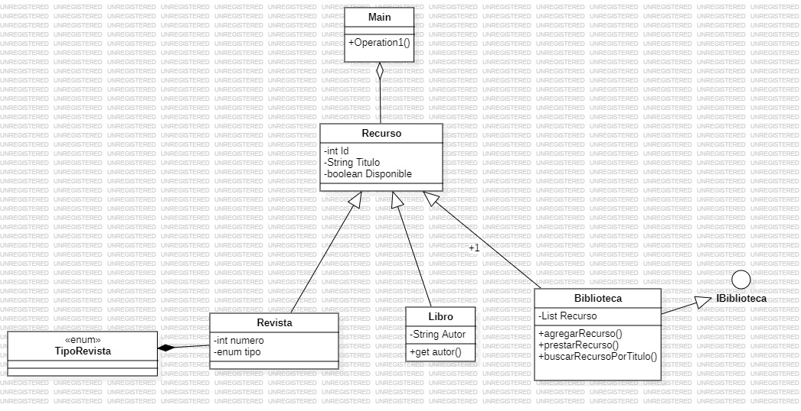

# Biblioteca 
En el presente repositorio se presenta el punto solicitado en el examen. 

### ¿Que contiene este repositorio?

* El presente repositorio contiene toda la informacion pertinente del primer punto 
* Contiene la imagen del diagrama de clases llamado "Imagen"

### Diagrama de clases 

Cualquier duda no olvides clonar este repositorio 